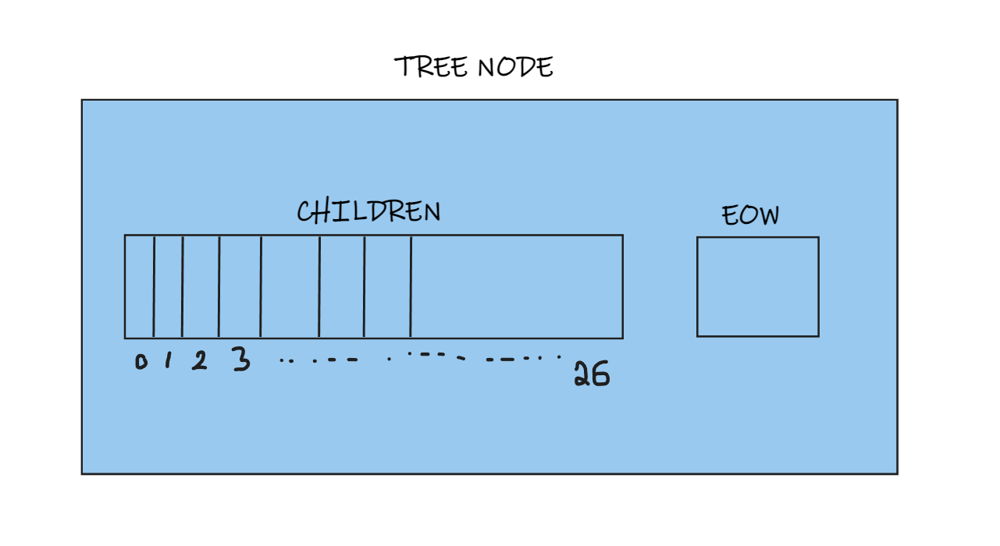
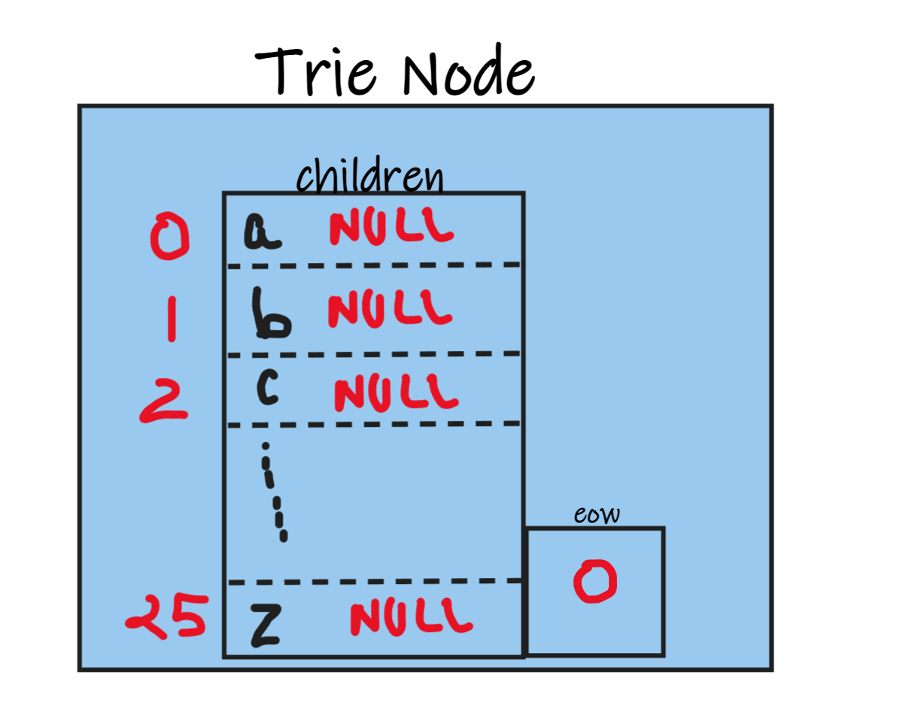
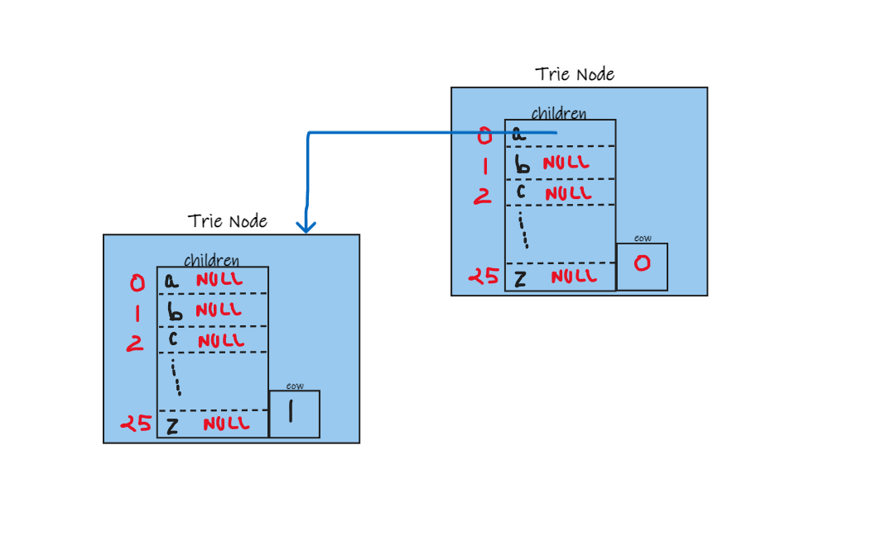
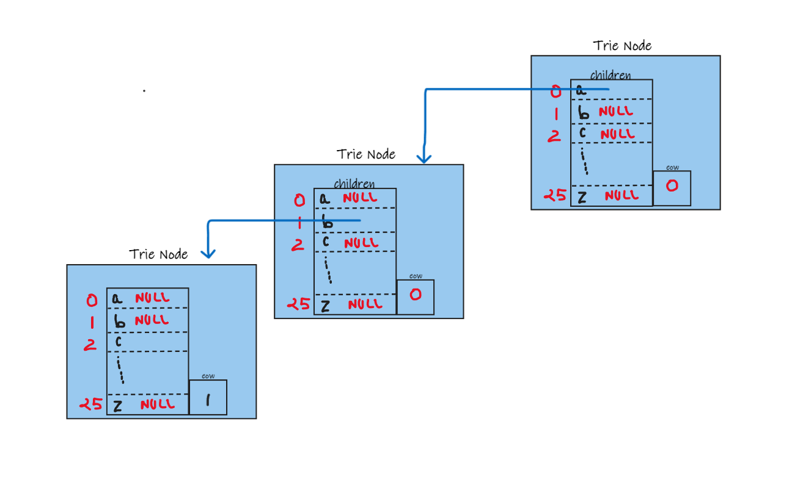
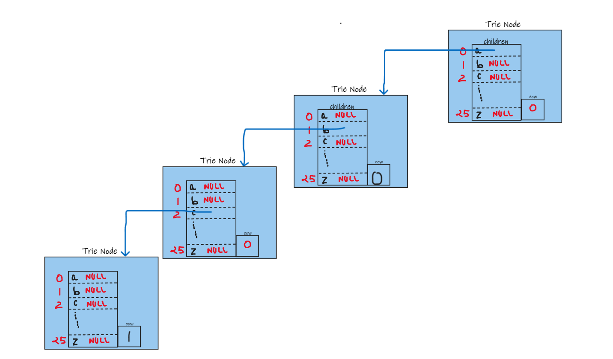
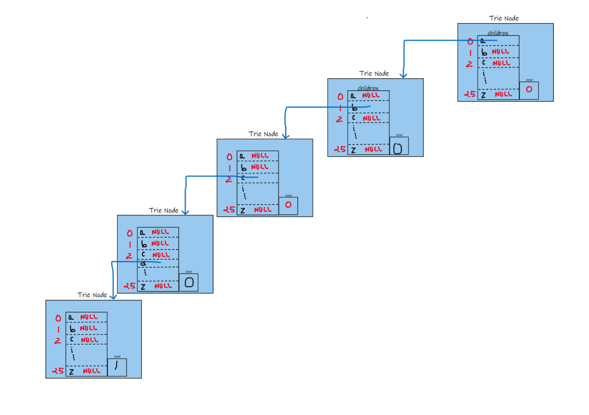
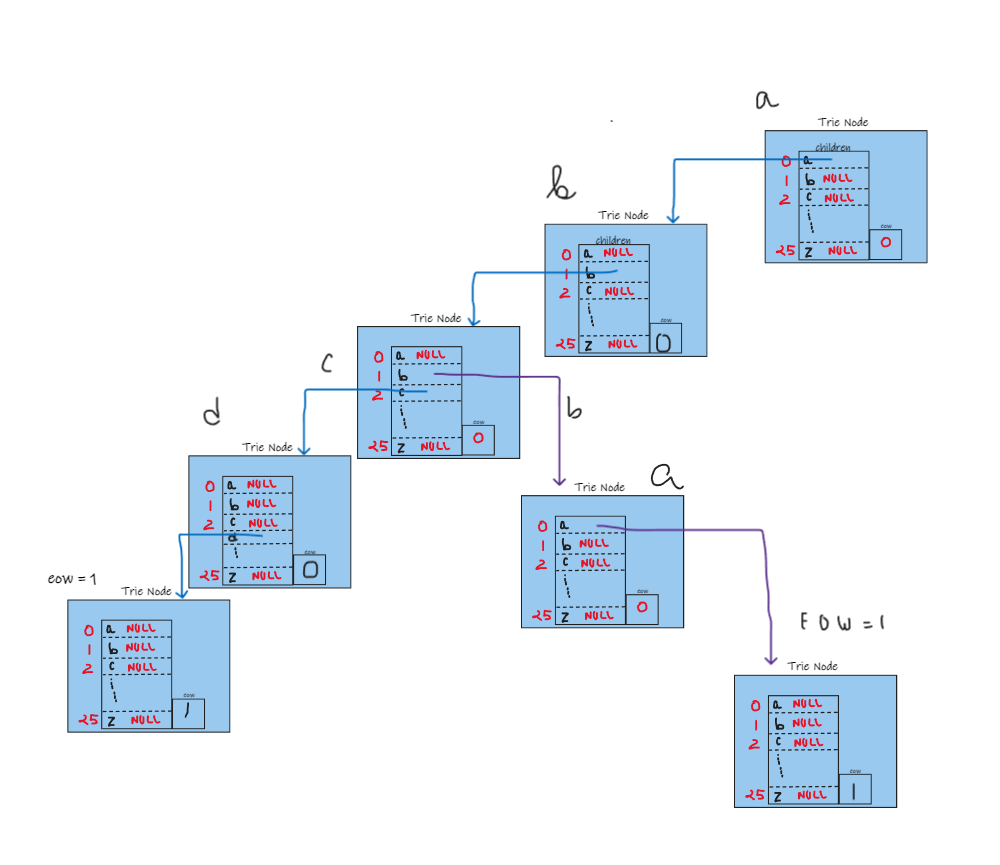

# What is Trie ??  

*Trie is a type of ***k-ary search tree*** used for storing and searching a specific key from a set. Using Trie, search complexities can be brought to optimal limit (key length).* 


 ```Makes no sense right??```

Okey lets talk about this, 

We already have a data structure named ***HASH MAP*** which is used to search something in nearly constant time right , so why on earth do we need a ___new Data Structure___ again.  

So to answer this question let me ask you a question I give you lets say 50 string and ask you to store it in such a way that it can be implemented in __Autocompletioon__ or lets say printing word __in Alphabetical order__ 
<br>  

---  

# Features of Trie

Lets talk about some feature of Trie :

* Its a Tree Based __Collection Of Trees__
    * It means we store strings in a form of a tree.
<br><br>
  

* ``` Its a  M array Tree```
    * Means the number of Child is user defined.  
    It can be 26 which is number of alphabets or it can be 255 number of ascii values

* The Data is Automatically sorted in this Data Structure.

* Also called Digital or Prefix Tree.  
<br>  

## Structure Of a Trie Tree

~~~ C 

    struct treenode
    {
        struct treenode *children[26];
        int eow;
    }
~~~

    

``` In This Structure all the indices are pointing toward Null initially and when we make a string we connect that particular index pointing to next strucutre lets say you insert a you change the pointer of index  i.e towards next structure ```
---
<br><br>
## Insertion in Trie Tree


> Insert abcd , abba

#### Initial Structure 


Lets Add    ___a___



Lets Add ___b___



Lets Add ___c___



Lets Add ___d___



Simulateously if we add a new string ___abba___




# Lets code 

~~~c
typedef struct trienode
{
    struct trienode *children[255];
    int eow;
}node;
~~~

<br>

```So This will be the structure that we will be using throughout the code children array is an array of refrence like the ascci value and EOW is the end of word flag```

> Eow = 1 the word ends  there 
<br>

~~~c
node *getnode()
{
    node* temp = (node*)malloc(sizeof(node));
    // You can use Calloc here to remove For loop
    for( int i =0 ; i<255 ; i++)
    {
        // initializing all the values of children to NULL
        temp->children[i]==NULL;
    }
    temp->eow =0 ;
    return (temp);
}
~~~

``` Above Fucntion is an helper function that helps us creating a Trie Node ```

<br>

---

### Insert Function 
--- 
<br>

~~~c 
/**insert function takes two argument 1st one being key that is the string to be inserted and second one being the root node of the trie tree*/

void insert(char * key , node* root)
{
    node * cur = root ;
    for( int i =0 , key[i]!= '\0';i++)
    //use a while loop if you like
    {
        index= key[i];
        if( cur->children[index]==NULL)
        {
            cur->children[index]==getnode();
        }
        cur=cur->child[index];
    }
    cur->eow=1
}
~~~

```Lets Understand the working of Insert Fucntion, as we can see insert function takes two arguments key string to be inserted and the root of the trie tree ```

<br>
Lets Break the function into snippets to understand the function:  

<br>


~~~c
for( int i =0 , key[i]!= '\0';i++)
~~~

``` The above line is basically checking while the key string is not empty.```  

~~~c 
    index= key[i];
~~~
<br>


Since __key [ i ]__ is a charecter so when we store it in a integer varibale ( ***index*** ) we store the ascii value of **key [ i ]** in  the index.  
> In C when we try to store a charecter variable in a integer variable we unknowingly store the ascii value of the charecter in the integer variable.

<br>
So index basically has the ascii value of key[ i ] <br> 
<br>

~~~c
    if( cur->children[index]==NULL)  
    {
        cur->children[index]==getnode();
    }
~~~ 

<br>

```If the index (by ascii ) is not filled yet then we create a node and add it make a link form that index  ( by ascii ) to the new node .```


> see in this image we were trying to add abcd so we added ___a___ then we added ___b___ the index of **b**  was initially null so we created a new node

<br><br>

> But take a look at this example


> In this image we can see that the node was already created so we didnt create a new node we just navigated to a new branch.


~~~c
cur=cur->child[index];
~~~

Then we move onto the node we created/ or the node which was already present there. 

```After coming out the for loop we make eow =1 i.e when the key string is complete ```

<br>

---

### Display Function 
--- 
<br>

~~~c
void display( node * root)
{
    node* cur = root ;
    for ( int i =0 ; i<255; i++ )
    {
        if( cur->children[i]! =NULL)
        {
            str[length++]=i;
            if( cur-> children[i]-> eow ==1)
            {
                printf("\n");
                for ( int j =0 ; j < lenght ;j++)
                {
                    printf("%c", str[j]);
                }
                display(cur-> children[i]);
            }
        }
    length--;
    }
}
~~~

```Lets Try to decode how the display function works```

```Display Fucntion takes only one argument i.e the root node from where we will be printing the strings```

~~~c 
node* cur = root ;
for ( int i =0 ; i<255; i++ )
~~~


<br>

---

### Prefix Display or Auto-Complete-Feature
--- 
<br>

~~~c
void prefixtree( node * root , char * prefix)
{
    node *cur = root;
    int index;

    for ( int i= 0 ; i < prefix[i]! = '\0';i++)
    {
        index = prefix [i];
        if( cur->children[ index ]!= NULL)
        {
            str[length++]= index;
            cur= cur->children[index];
        }
    }

    if( cur -> eow ==1)
    {
        for(j=0; j< length ; j++)
        {
            printf("%c", str[j]);
        }
    }
    display(cur);
}
~~~